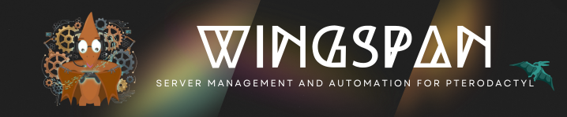

```
                              )       \   /      (
                             /|\      )\_/(     /|\ 
    *                       / | \    (/\|/\)   / | \                      *
    |`.____________________/__|__o____\`|'/___o__|__\____________________.'|
    |                           '^`    \|/   '^`                           |
    |                                   V                                  |
    |                                                                      |
    |     /|   _       _______   _____________ ____  ___    _   __  |\     |
    |    //|  | |     / /  _/ | / / ____/ ___// __ \/   |  / | / /  |\\    |
    |   ///|  | | /| / // //  |/ / / __ \__ \/ /_/ / /| | /  |/ /   |\\\   |
    |  ////|  | |/ |/ // // /|  / /_/ /___/ / ____/ ___ |/ /|  /    |\\\\  |
    | /////|  |__/|__/___/_/ |_/\____//____/_/   /_/  |_/_/ |_/     |\\\\\ |
    | .__________________________________________________________________. |
    |'               l    /\ /     \\            \ /\   l                 `|
    *                l  /   V       ))            V   \ l                  *
                     l/            //                  \I
                                   V
```

### Welcome to Wingspan, Server Management and Automation for Pterodactyl!

**Project submitted to Submitted to [Stardance, Hack Club](https://stardance.hackclub.com)**

Are you a shipright? Check out the shipwrights.md <3


---

### Install Release for both Linux and Windows
Wingspan well supports both Windows and Linux. To download and run, please visit the [release page](https://github.com/brahmtej2009/Wingspan/releases/tag/V1-Release01). The app installs its own required dependencies and performs self-update. The app runs a guided setup when you boot it for the first time! I hope you have a great time with Wingspan!


# What was the Problem, What I fixed (Project Info)
Pterodactyl is a really famous server management tool, but for hosting owners who have more than a hundred servers, managing each of those individually takes a lot of effort. Making a bulk manager tool was really essential, because it allows admins to perform actions in massive quantities, automatically, saving a lot of time and hard work on repeated work. Actions such as transfers required us to transfer each server one by one and had no automation, with wingspan, you could select the servers to transfer, it manages everything as you set. Not just limited to transfers, it can also bulk search servers, perform server purge functions, take bulk backups, perform bulk resize, reinstalls, updates and more.


---

# Features
- Server Search
- Bulk Suspend/Unsuspend
- Selective Purge 
- Backup download
- Bulk resource resize / copy-paste resources
- Bulk Reinstall
- Bulk Transfer 
- Advanced Search & Filter 
- Node/Panel health dashboard 
- User management 
- Update monitor

---

# Installation From Source Files

To install, ensure you have Python 3.12 or neighboring versions installed.

Note: The project makes its own venv on boot, and also installs its own dependencies, there is NO dependency install step for both linux and windows.

### DEMO
> For Voters / Shipwrights who are testing this, I have installed a demo readonly pterodactyl, which would be deleted after voting is done on this project. Please use the following credentials.
        
- Panel URL: https://demopanel.thehytalehost.com/
- Admin User API Key: ``ptlc_QQ4DDo1ebJjLuwVVb41iJ4Dc5WuRZmbcZvz3tRv2NJf``
- Application API Key: ``ptla_GCYaHWj6Z9ayQjp3UdQVlSAFsFneyt2sxFNbwOWDwiP``
---

### Installation Method:
### 1. Clone the repo
```git clone https://github.com/brahmtej2009/wingspan```

### 2. Run to boot to Setup
```python3 main-cli.py```

Would boot into main dashboard after setup everytime!

---

# Functions & Uses

## Homepage
## 1. Search and Info
- > **1. Server Search**: 
    
        Allows you to enter ranges for values of parameters to search and filter servers, then export them to csv or take action on those selected servers. This function is used to export an importlist, which is used in other functions.
- > **2. Server Info**: 
        
        Allows you to enter a single server ID (Numeric) to fetch all information of it on a single page with good formatting.

## 2. Purge Bot

- > **1. Server  Purge**: 

        Simple everyday purge, where a keyword must be present in the server name to make it survive, else would be deleted. For data safety reasons, we dont keep it case sensitive, that means if purge protection word is "Prot", then servers with "prot"/"PrOt"/"pROT" (etc.) in name would be protected too. 
- > **2. User Purge**: 
        
      User based purge, gives ability to delete users who dont have a server, or specific deletion by providing an importlist..

## 3. Power Actions
    > This function allows you to bulk start, stop, and kill servers by providing an importlist.
## 4. Suspension Manager
    > This function allows you to Suspend and Unsuspend servers by providing an importlist. Servers which are suspended are stopped immediately.
## 5. Bulk Resource Change
    > This function allows you to run commands to change multiple parameters of your servers in bulk, all at once by providing an importlist.

## 6. Bulk Reinstall
    > Allows you to re-trigger the installation script for all servers in a given importlist.
## S. Run Setup Again
    > Allows you to launch the setup menu again to re-link the same pterodactyl or link a new pterodactyl. Keep in mind that if the panel is re linked, old importlists may not work the same way, and may effect different servers, which may not be suitable.

# Contributing
The project is driven by community support only, your efforts would mean a LOT to this project and to all its users. For any suggestions, issues, bugs, please feel free to contribute to this project by either informing me, raising a github issue ticket, or adding a PR with the required changes performed. 

---

# Credits
ASCII art credit

Alan Greep - The banner for Wingspan with the Pterodactyl was an awesome open source ASCII Art which I edited. 

---

# My other libraries used in this project!
Pytterns : https://github.com/brahmtej2009/pytterns

---

# License
AGPLv3
