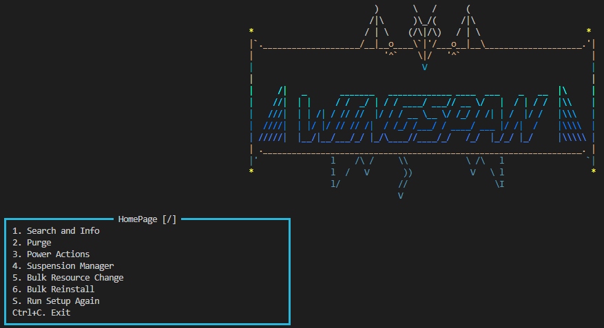
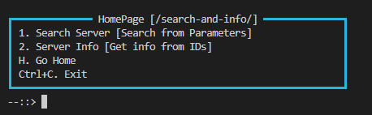

# Hello Shipwrights/Voters!
Welcome to my project, it is an infrastructure management project, which helps you manage servers if you own/manage a server hosting or a pterodactyl panel.

As you are most likely not having physical servers or pterodactyl panel installation, I have given a demo pterodactyl api key in the README which you could use to test this. If you are reviewing this, and see me online, just drop a message and i'll guide you through the entire testing, as it could get confusing, If not, you can follow the documentation below.

The code is not built into an exe, because its meant to be a universal file, which you could clone and run anywhere. The script downloads its dependencies by itself upon first setup, so it would work on any system, and any OS, with a single file.

# Getting Started

Follow the readme doc for getting started.

> **The API Key:** You need an API key to use this software. A demo key has been created by me, and is in the Readme. Please use that key while setup along with the url and other detailed provided there. 

# Testing after setup
In reality, a server setup would have hundreds of servers, my own instance has made about 40k+ servers in its lifetime, so testing environment is quite limited, but enough to test if the project works.

---
1. **Guided Setup :** The project has a guided setup which would automatically set up your API key and dependencies, please run the setup command (process written in Readme) and fill in the DEMO API details.
2. **After you are at the home page, which looks like this:**
    
    
    **Select the option 1** (Thats the only one available in the first ship, others would be released in future updates, created homepage so documentation could be standardized)

3. **After selecting Option 1:**
    
    1) **Search Server :** Allows you to use big list of parameters to filter and export a list of filtered servers. Parameters are fetched from API from panel, so if in future a new parameter is added, this code would not need to be changed, it works accordingly. 

        > How to test: In this menu, select name and ID, through space bar and up and down arrows. For testing, enter ID=`1-3` and Name=`*SMP`. This would show you servers having ID from 1 to 3, with the word SMP at end of their name. If it does, it works correctly!

    2) **Server Info :** Allows you to enter 1 Server ID to get a huge UI of all the details about that server, Including live resource usage. Shows you an extremely detailed menu with things like Server Owner details, Creation/Last Updation Dates, Docker Image used for server, Ports connected, and a lot more
    
        > How to test: In this menu, enter server ID from 1 to 5, It would show you a detailed menu of server details.

    3) **Export Function :** Allows you to export the bulk server list to a CSV file to use for other functions like Purge, Power Actions, etc. CSV File includes the Server's ID + Server Name. No sensitive information is included, so no data leak risks if file gets leaked. Sensitive information is stored in memory only, and never stored, gets deleted after the task is done. This much information is enough for Wingspan to take action on those servers. Server actions would be added in the next ship. 

4. **Other features :** I consider this project as about 40% done, even though only 1 out of 6 functions are made. This is because there is a lot of shared code and most of the things here are API based. The API system is complete, and only translating the user needs to API requests is left for the remaining functions. The project size is in the medium-big category. Also, the project has a guided setup menu (Accessed by S at the home page), which guides users how to set up the pterodactyl API Key.

# Thankyou Shipwrights for testing my project 💝